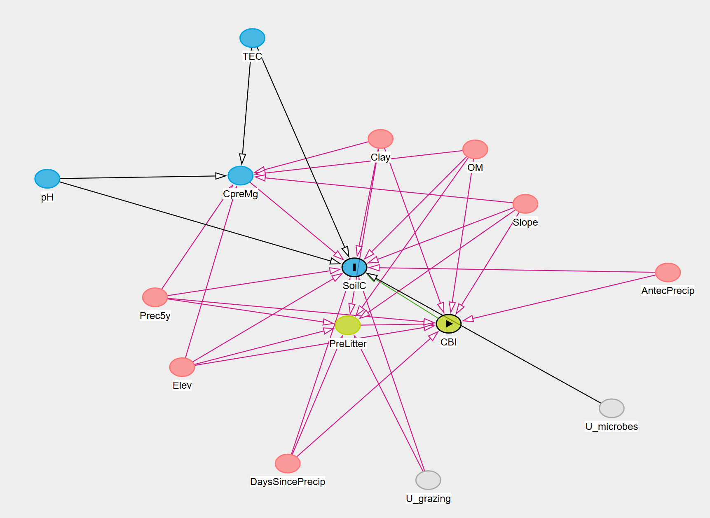
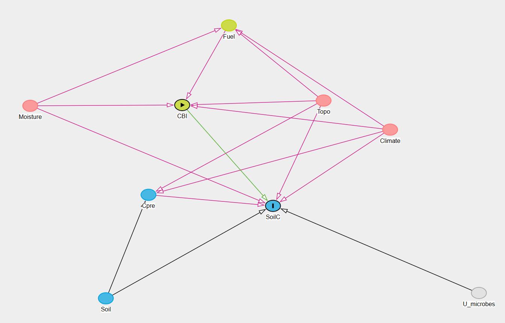
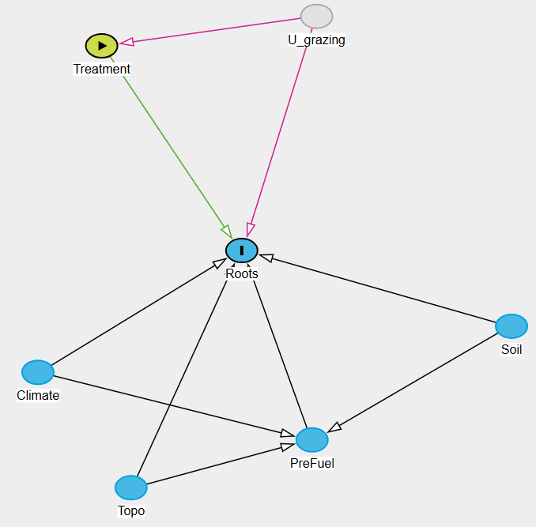
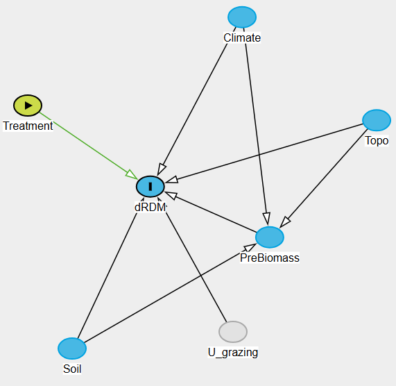

## ⍟ Exploratory Analysis

Now that I finished data wrangling, it's time to create exploratory plots and DAGs. The first thing I wanted to sort out was which predictor variables to include in my model for each response (change in soil C Mg per ha, change in residual dry matter (aboveground biomass), and root biomass in the first growing season). From my `analysis_carbon` dataframe, I had 72 predictors, broken up into four categories: weather, soil properties, topography, and fuel metrics.

```{r}

# Read in the data
analysis_carbon <- readRDS(here::here("data", "analysis_carbon.rds"))

# Look at column names
colnames(analysis_carbon)
```

I decided to create DAGs (Directed Acyclic Graph) for each response variable, so that I could consider what predictors are conditional on each other, mask each other, etc.

## Change in Soil C - DAG (Causal)

For **change in soil C**, I only looked at burn-only transects. The question was then: *Among burned transects, does more severe fire change the outcome in soil carbon?* To measure burn severity, I created the Composite Burn Index (CBI) whihc includes pre-burn residual dry matter, change in litter, and percent cover in Black/Green/Unburned. This predictor is used instead of Treatment (Burn/Control). The other predictors I thought could be important, included:

-   Antecedent moisture (e.g., days_since_precip, antec_precip): This is a proxy for how dry the soil was at the time of the burn. Moisture influences burn behavior and microbial/decomposition dynamics.

-   Texture (e.g., % Clay): Clay is a core driver in C stabilization

-   5 year Precipitation/Temperature: Good "site productivity/climate context" variables

-   Slope/Elevation: Slope can relate to fuels, moisture redistribution, erosion, and potentially fire behavior

-   Pre-burn soil C: Important to understand the baseline since its the starting point

-   Pre-burn fuel (e.g., litter or residual dry matter): Key for severity and carbon inputs/combustion potential –\> however, this is included in CBI

-   Soil fertility (e.g., OM%, pH, CEC)

-   Timing (e.g., Julian day of the year): phenology and soil moisture can shift quickly

My initial DAG was CBI \[exposure\] ➙ final_C_Mg_per_ha (SoilC) \[outcome\]:



\begin{multicols}{2}
Baseline site properties
   ├─ soil chemistry
   ├─ texture
   ├─ climate
   └─ topography
        ↓
   baseline soil C
   Unobserved (Microbes)
        ↓
   soil C change
\columnbreak
Antecedent moisture
Pre-burn fuels
Topography
Weather
Unobserved (Grazing)
      ↓
     CBI
      ↓
  Δ Soil Carbon
\end{multicols}

No combination of observed variables can close all the paths because some pass through unobserved variables (Pink pathways are where confounding exists). The minimal sufficient adjustment sets were antec_precip, clay, days_since_precip, elevation, Organic Matter %, Litter_Pre_burn, 5y_precipitation, and slope. I wanted to simplify the DAG to the minimal causal variables:

1.  Cpre (C_Mg_per_ha_Pre-burn) = baseline soil C stock
2.  Moisture (days_since_precip) = antecedent moisture/dryness
3.  Fuel (Litter_Pre_burn) = pre-burn fuel bed
4.  Soil (clay) = soil stabilization/fertility axis
5.  Topo (slope) = topographic context
6.  Climate (5y_precipitation) = long-term climate context



The new version have several backdoor paths like:

-   CBI ← Climate → SoilC

-   CBI ← Moisture → SoilC

-   CBI ← Topo → SoilC

Final minimal adjustment set is CBI, Climate (5y_precipitation or 5y_mean_temp), Moisture (days_since_precip or antec_precip), Topo (slope or elevation). This is a good DAG because it avoids post-treatment bias, avoids collider bias, closes all backdoor paths, and keeps the adjustment set minimal.

I now wanted to look at exploratory plots for this response variable since this gives the predictive signal.

## Change in soil C - Exploratory Plots

From my exploratory plots, there is not a clear direction in soil C Mg/ha by Site. In general, more transects decreased in soil C Mg/ha than increased post-burn. Both △ Soil C \~ CBI and △ Soil C \~ 5-year long term precipitation show little relationship. This compares with △ Soil C \~ Clay, which shows that sites with higher clay soils tend to gain more soil carbon (or lose less) after fire. Additionally, △ Soil C \~ Days Since Rainfall show that burns which occurred longer after rainfall (drier conditions) tend to show larger increases in soil carbon. Lastly, △ Soil C \~ Slope found that steeper slopes tend to experience larger increases in soil carbon after fire. The boxplot shows that there is a lot of site-level heterogeneity, which shows that it may mask one of the predictors.

```{r}
### Soil Carbon Change ###

# Load libraries
library("tidyverse")
library(here)
library(ggplot2)

# Need this to save exploratory plots
dir.create("figures/exploratory", showWarnings = FALSE, recursive = TRUE)

## Was baseline soil C similar in both the control vs. burn treatments?
soil1 <-
  ggplot(analysis_carbon, aes(Treatment, `Carbon (%)_Pre-burn`)) +
  geom_jitter(width = 0.1, alpha = 0.6) +
  stat_summary(fun = mean, geom = "point", size = 3) +
  stat_summary(fun.data = mean_se, geom = "errorbar", width = 0.2)
print(soil1)
## How did Carbon change in pre- vs. post-burn for burn transects?

# Overall relationship and magnitude in change in carbon (pre vs post)
 # Line plot directly visualizes the within-transect change
soil2<-
analysis_carbon %>% #df
  filter(Treatment == "Burn") %>% #filter for burn only
  ggplot(aes(`C_Mg_per_ha_Pre-burn`, `C_Mg_per_ha_Post-burn`)) + # x= Pre; y= Post
  # Adding a line to understand if there is a change
   # Above line → carbon increased post-burn
   # Below line → carbon decreased post-burn
   # No change = 0 = the line ; further away points have more magnitude in change
  geom_abline(slope = 1, intercept = 0, linetype = "dashed", color = "gray50") +
  # Add the original raw data points
  geom_jitter(width = 0.1, alpha = 0.6) +
  # Create another point that is the mean (larger size)
  stat_summary(fun = mean, geom = "point", size = 3) +
  stat_summary(fun.data = mean_se, geom = "errorbar", width = 0.2) +
  theme_classic()
print(soil2)
## Not a really clear relationship in whether carbon increased or decreased
 # Seems like some sites increased more in C post-burn (greater magnitude)
   # but why?
 # It seems like sites with initial lower soil C, decline more in soil C post-burn, whereas sites with higher initial soil C increase in soil C post-burn
  # Could something be getting masked? Look back at the lecture
   # Maybe the sites with more initial carbon have more clay?

#labs(x = NULL, y = expression("Change in soil C("*Mg~ha^{-1}*")"))

# Frequency of increases vs. decreases in soil C
# Histogram of the total change in %C
soil3 <-
analysis_carbon %>% 
  # final_Carbon_pct is the change in soil C post-pre
  ggplot(aes(x = final_C_Mg_per_ha)) +
  # Create a histogram of the change in soil %C
  geom_histogram(bins = 20) +
  # Add a line at 0 to see when it decreases (<0) vs. increases (>0)
  geom_vline(xintercept = 0, linetype = "dashed") +
  theme_classic()
print(soil3)
## More transects experienced decreases in soil carbon than increases
 # This decrease is small (around -1 to -3 Mg C ha-1)
 # There are a few large increases (up to ~14 Mg C ha-1)
  # This is why the pre-post scatter plot looked balanced
 # Vertical dash at 0 = where there is no change
 # Left of line = carbon decreased after fire
 # Right of line = carbon increased after fire

# What is the mean change in soil C? 
mean(analysis_carbon$final_C_Mg_per_ha, na.rm = TRUE) #-0.2321144
median(analysis_carbon$final_C_Mg_per_ha, na.rm = TRUE) #-0.42075
 ## Shows there is a net carbon loss

# Change in soil C ~ CBI
soil4 <-
analysis_carbon %>%
  filter(Treatment == "Burn") %>%
  ggplot(aes(CBI, final_C_Mg_per_ha)) +
  geom_hline(yintercept = 0, linetype = "dashed", color = "gray40") +
  geom_point(size = 2.5, alpha = 0.8) +
  geom_smooth(method = "lm", se = TRUE) +
  labs(
    x = "Composite Burn Index (CBI)",
    y = expression(Delta*" Soil C (Mg ha"^{-1}*")")
  ) +
  theme_classic(base_size = 14)
print(soil4)
## The regression line is almost flat
 # Burn severity does not appear to strongly predict changes in soil carbon
 # CI interval overlaps with zero, so this means there is no clear relationship   between severity and soil carbon change
 # In some sites, there were a few positive increases (~8-13 Mg C ha-1) whic could be due to ash deposition, post-fire productivity, sampling variability, and soil heterogeneity

# Change in soil C ~ Pre-burn soil C
soil5 <-
analysis_carbon %>%
  filter(Treatment == "Burn") %>%
  ggplot(aes(`C_Mg_per_ha_Pre-burn`, final_C_Mg_per_ha)) +
  geom_hline(yintercept = 0, linetype = "dashed") +
  geom_point(size = 2.5) +
  geom_smooth(method = "lm", se = TRUE) +
  labs(
    x = "Pre-burn soil C (Mg ha⁻¹)",
    y = expression(Delta*" Soil C (Mg ha"^{-1}*")")
  ) +
  theme_classic()
print(soil5)
## Sites with higher pre-burn soil carbon tend to gain slightly more carbon after fire (or lose less) (but this is a VERY shallow slope, and CI overlaps zero)

# Change in soil C ~ 5 year precip (Climate)
soil6 <-
analysis_carbon %>%
  filter(Treatment == "Burn") %>%
  ggplot(aes(`5y_precipitation`, final_C_Mg_per_ha, color = Site)) +
  geom_hline(yintercept = 0, linetype = "dashed", color = "gray40") +
  geom_point(size = 2.5, alpha = 0.8) +
  geom_smooth(method = "lm", se = TRUE, color = "black") +
  labs(
    x = "Mean annual precipitation (5-year)",
    y = expression(Delta*" Soil C (Mg ha"^{-1}*")")
  ) +
  theme_classic(base_size = 14)
print(soil6)
## The regression line slopes downward, suggesting the sites with higher precipitation tended to lose more soil carbon after fire.
 # Drier sites tended to gain or maintain soil carbon more often.
 # Wet sites: higher productivity, more litter, more combustion --> carbon loss
 # Drier sites: lower fuel, less combustion, ash inputs may dominate --> slight carbon gain
 # CI crosses zero, so the relationship is statistically weak
 # There is no obvious clustering of severity with ΔC.
 # Mean monthly precipitation (30 mm	relatively dry site/month; 60 mm	moderate precipitation; 85 mm	wetter site)
 # ~30 = PL, ~40 = TKR, ~50 = CSR, ~60 = WR sites, ~70 = CF, ~80 = AM
 # Highest increases at TKR (maybe also since there is grazing) and largest decreases at WR (maybe soil texture, fuel loads, burn timing, grazing history)

# Boxplot of change in soil C by Site
soil7 <-
  analysis_carbon %>% 
  filter(Treatment == "Burn") %>%
  ggplot(aes(Site, final_C_Mg_per_ha)) +
  geom_hline(yintercept = 0, linetype = "dashed") +
  geom_boxplot(outlier.shape = NA) +
  geom_jitter(width = 0.15, alpha = 0.7) +
  theme_classic()
print(soil7)
## Super informative, since it highlights site-level heterogeneity in soil C
 # Dashed line at 0 = no change
 # Each box shows the distribution of transects within that site
 # Most increases at TKR and CSR (but also decreases)
 # Biggest decrease at MF (=3 Mg C ha-1), WR13, CF 
 # When site-level heterogeneity is large, it can mask relationships with other predictors.

# Change in soil C ~ texture (clay)
soil8 <-
analysis_carbon %>% 
  filter(Treatment == "Burn") %>%
  ggplot(aes(clay, final_C_Mg_per_ha)) +
  geom_hline(yintercept = 0, linetype = "dashed") +
  geom_point() +
  geom_smooth(method = "lm") +
  theme_classic()
print(soil8)
## More meaningful plot
 # Dashed line = no change in soil carbon
 # Above the line, carbon increases ; below the line, carbon decreases
 # Higher clay soils tend to gain more soil carbon (or lose less) after fire.
  # Sandy soils tend to lose more soil carbon.
  # Clay rich soils protect organic carbon (stronger mineral–organic matter binding, greater carbon stabilization, slower decomposition, better moisture retention)

# Boxplot of clay by Site
soil9 <-
ggplot(analysis_carbon, aes(Site, clay)) +
  geom_boxplot()
print(soil9)
## AM = 5-12% clay, CSR = 10-15% clay, MR = 16-20% clay, PL = 14-22% clay, CF = 18-23% clay, WR13 = 20-25% clay, WR5 = 23-27% clay, WR22 = 28-35% clay, TKR = 38-50% clay
 # Clay does not vary much within sites, but it varies between sites
  # Clay effect ≈ Site effect

# Change in soil texture ~ clay (colored by Site)
soil10 <-
ggplot(analysis_carbon,
       aes(clay, final_C_Mg_per_ha, color = Site)) +
  geom_point(size = 3) +
  geom_hline(yintercept = 0, linetype = "dashed") +
  geom_smooth(method = "lm", se = FALSE, color = "black") +
  theme_classic()
print(soil10)
## Transects with higher clay content tend to have slightly more positive Δ Soil C
 # Transects with lower clay tend to have slightly more negative Δ Soil C

# Δ Soil C vs Site precipitation × clay interaction
soil11 <-
ggplot(analysis_carbon,
       aes(`5y_precipitation`, final_C_Mg_per_ha, color = clay)) +
  geom_hline(yintercept = 0, linetype = "dashed") +
  geom_point(size = 3) +
  geom_smooth(method = "lm", se = FALSE, color = "black") +
  scale_color_viridis_c(name = "Clay (%)") +
  theme_classic()
print(soil11)
# Higher precipitation sites tend to lose slightly more soil carbon after fire (but this is weak - not a strong predictor)
 # Clay values vary across the precipitation gradient
  # Drier sites tend to have higher clay
  # Wetter sites tend to have lower clay
 # Precipitation may be confounded

# Is 5 year precip and clay correlated? 
cor(analysis_carbon$clay, analysis_carbon$`5y_precipitation`) #-37% (No)

# Change in soil C ~ days since precipitaiton on burn date
soil12 <-
analysis_carbon %>% 
  filter(Treatment == "Burn") %>%
  ggplot(aes(days_since_precip, final_C_Mg_per_ha)) +
  geom_hline(yintercept = 0, linetype = "dashed") +
  geom_point() +
  geom_smooth(method = "lm") +
  theme_classic()
print(soil12)
# Burns that occurred longer after rainfall (drier conditions) tend to show larger increases in soil carbon.
 # Burns that occurred soon after rainfall tend to show more carbon losses or little change.
 # CI band is wide, so the relationship is weak to moderate
 # Burns soon after rainfall: soils are moist, combustion may be incomplete, microbial decompostion may be active, ash incorporation may be slower
 # Burns long after rainfall (drier fuels) - fuels are drier, fire may burn hotter, more ash deposition, ash can increase soil C measurements temporarily
 # If I filter it to not include burns > 100 days since rainfall, then days since precipitation does not appear to influence soil carbon change within the typical burn window.

# Change in soil C ~ slope on burn date
soil13 <-
analysis_carbon %>% 
  filter(Treatment == "Burn") %>%
  ggplot(aes(slope, final_C_Mg_per_ha)) +
  geom_hline(yintercept = 0, linetype = "dashed") +
  geom_point() +
  geom_smooth(method = "lm") +
  theme_classic()
print(soil13)
## Could be a meaningful plot
 # x-axis = terrain steepness (slope)
 # Dashed line at 0 = no change in soil C ; below line = loss of soil C
 # Steeper slopes tend to experience larger increases in soil carbon after fire.
 # Flatter areas tend to experience more carbon losses
  # Steeper slopes = thinner soils, faster drainage, lower soil moisture, lower decomposition rates, greater ash retention
  # Flatter areas could mean deeper soils, higher productivity, more microbial activity, faster decomposition

# Boxplot of slope by Site
soil14 <-
ggplot(analysis_carbon, aes(Site, slope)) +
  geom_boxplot()
print(soil14)
## High slope (9-16) is mostly at TKR, low slopes = mostly other sites
 # TKR → steep slopes → large carbon gains
 # In the mixed model, if I keep Site as a random effect and slope remains significant, then slope has an effect within sites ; otherwise, slope pattern is just site differences

## Exploratory analysis is about predictive signal, not causal adjustment.
 # Suggested from exploratory plots:
  # ΔSoilC ~ slope + precipitation + clay + CBI + (1 | Site)
 # Reconciled with the DAG: 
   # ΔSoilC ~ CBI + climate + moisture + topography + soil_texture + (1 | Site)
  # ΔSoilC ~ CBI + 5y_precipitation + days_since_precip + slope + clay + (1 | Site)
## Clay wasn't required in the DAG because it may not lie on a backdoor path, but it can still improve the model (carbon stabilization, microbial turnover, soil OM)
 # It's a mechanistic predictor, not a collider

# Print Exploratory Plots for Quarto Document
# Create helper function to save the plot into figures
# Create helper function to save plots
save_plot <- function(plot_obj, name, subfolder, w = 6, h = 4) {

  dir.create(file.path("figures", "exploratory", subfolder),
             showWarnings = FALSE, recursive = TRUE)

  ggsave(
    filename = file.path("figures", "exploratory", subfolder, paste0(name, ".png")),
    plot = plot_obj,
    width = w,
    height = h,
    dpi = 600
  )
}

#| echo: false        # hide the code in the rendered PDF
#| results: 'hide'    # hide any output so plots don't print again

# Save all soil exploratory plots
exploratory_plots_soil <- list(
  soil1 = soil1,
  soil2 = soil2,
  soil3 = soil3,
  soil4 = soil4,
  soil5 = soil5,
  soil6 = soil6,
  soil7 = soil7,
  soil8 = soil8,
  soil9 = soil9,
  soil10 = soil10,
  soil11 = soil11,
  soil12 = soil12,
  soil13 = soil13,
  soil14 = soil14
)

for(n in names(exploratory_plots_soil)) {
  save_plot(exploratory_plots_soil[[n]], n, "soil")
}

```

## Change in soil C - Final Checks

Combining the DAG and exploratory plots, there is four potential models:

1.  Model 1 (strict DAG adjustment):\
    ΔSoilC \~ CBI + 5y_precipitation + days_since_precip + slope + (1 \| Site)
2.  Model 2 (add soil control, and swap slope with clay since correlated):\
    ΔSoilC \~ CBI + 5y_precipitation + days_since_precip + clay + (1 \| Site)
3.  Model 3 (test precipitation interaction):\
    ΔSoilC \~ CBI + 5y_precipitation + days_since_precip + slope + clay + CBI:5y_precipitation + (1 \| Site)
4.  Model 4 (site fixed effect model):\
    ΔSoilC \~ CBI + 5y_precipitation + days_since_precip + slope + clay + Site

\*\* One thing to be mindful of:

-   Partial identifiability problem since many predictors are site-level (e.g., 5y_precipitation, 5y_mean_temp, days_since_precip) –\> every transect gets the same value

-   The random effect (1 \| Site) already estimates a separate intercept for each site, but since these variables only varies by site, they compete to explain the same variation

-   This can lead to very large SE, unstable coefficient, effect disappears, or model warning

-   If compared the mixed effect (1 \| Site) versus Site as a fixed effect and site-level predictors are similar, then this is robust

    -   Exploratory plots hinted at the issue since they were clusted by site for precipitation and slope

    -   Why we are also including the fourth model (Site as a fixed effect)

A few more exploratory plots show that sites with higher precipitation tend to show more negative Δ soil carbon. For the correlations, slope vs. clay has r = 0.67; slope vs. days since precip has r= -0.56. The response and predictor distributions are relatively normal, so the family for the model is Gaussian (no transformations needed).

```{r}
# Diagnostic for within-site variation for the predictors
analysis_carbon %>%
  group_by(Site) %>%
  summarise(sd_precip = sd(`5y_precipitation`), # SD ≈ 0
            sd_days_since_precip = sd(days_since_precip), #SD ≈ 0
            sd_slope = sd(slope),
            sd_clay = sd(clay))
## SD ≈ 0 → predictor is site-level only.
 # Creates partial confounding
 # Model can still run, but the precipitation effect may be unstable

## When keeping (1 | Site) as a random effect, then this explains the "unexplained site differences
 # 5y_precipitation and days_since_precip = systematic climate gradient across sites

# Do wetter sites respond differently to fire than drier sites?
 # Site Mean for soil C
site_means_soilC <- analysis_carbon %>%
  filter(Treatment == "Burn") %>%
  group_by(Site) %>%
  summarise(
    dC = mean(final_C_Mg_per_ha, na.rm = TRUE),
    precip = first(`5y_precipitation`)
  )

# Plot relationship
ggplot(site_means_soilC, aes(precip, dC)) +
  geom_point(size = 3) +
  geom_smooth(method = "lm", se = FALSE)
## Sites with higher precipitation tend to show more negative Δ soil carbon.

# Check for Model Predictor Correlations
analysis_carbon %>%
  select(
    CBI,
    `5y_precipitation`,
    days_since_precip,
    slope,
    clay
  ) %>%
  cor(use = "pairwise.complete.obs")
## slope vs. clay has r = 0.67
 # Steeper sites tend to have more clay (this was because of TKR)
  # Possibly split up models (could represent the same environmental gradient):
   # ΔSoilC ~ CBI + precip + moisture + slope + (1 | Site)
   # ΔSoilC ~ CBI + precip + moisture + clay + (1 | Site)
## Testing them separately helps determine which better explains carbon response.

## 5y_precipitation vs. days_since_precip has r = -0.53
 # Wetter climates tend to have shorter dry periods.

## Look at predictor distributions
 # Good for checking whether I need transformations
analysis_carbon %>%
  select(CBI, slope, clay, `5y_precipitation`) %>%
  pivot_longer(everything()) %>%
  ggplot(aes(value)) +
  geom_histogram() +
  facet_wrap(~name, scales = "free")
## No problematic distributions, so I don't need to do transformations
# 5 year precip - very discrete, mostly around 60 mm
# CBI - continuous from 0.4 to 2.1, symmetric, no extreme skew
# clay - unimodial, 5-55%, slight right skew with some high-clay sites
# slope - mostly low slopes (1-5) and a few high slopes (15-16)
  # Fine to include but high slopes may have high leverage

# Look at the response distribution
soil15<-
ggplot(analysis_carbon, aes(final_C_Mg_per_ha)) +
  geom_histogram()
print(soil15)
## mild skew, moderate outliers, non-perfect normality
 # Centered roughly around 0
 # Most observations between -3 and +2
 # Some larger positive values (~5-13)
 # A few large negative values (~-7 to -8)
## Gaussian error is reasonable.

## Completed exploratory phase: 
 # DAG → exploratory plots → correlation checks → distributions → response check
```

## Root Biomass Post-burn - DAG

For root biomass and aboveground biomass (RDM), this does contain both Treatment (Burn/Control) transects; thus, conditioning on the Composite Burn Index (CBI) would block part of the burn effect (post-treatment bias). The question now for **root biomass (g)** is: *Does burning change belowground biomass?* or *What is the total effect of Treatment (Burn vs Control) on first growing season root biomass?*

The predictors that are likely important, include:

-   5 year precipitation - Site level productivity

-   Texture (% Clay): Water holding, aeration constraints

-   Pre-burn aboveground biomass (RDM): Proxy for productivity between burned and contrrol treatments

-   Topography: Affects moisture/soil depth

-   Unobserved variables: grazing, microbial community, soil temperature (partially block them with Site as a random effect)

My initial DAG was Treatment \[exposure\] ➙ Roots_g_per_m2 \[outcome\]:

{width="412"}

This model would include Treatment, 5y_precipitation, clay, slope, and RDM_g_preburn, with Site as a random effect. Now I need to compare my DAG to exploratory plots.

## Root Biomass Post-burn - Exploratory Plots

The questions I'm exploring, include:

1.  Is Treatment (Burn/Control) associated with root biomass?
2.  Do environmental covariates influence root biomass and potentially confound the Treatment effect?

From my boxplot, it appears like there is more root biomass post-burn in Burn vs. Control, but the variability is large (i.e., Treatment effect may exist). Some sites have larger increases post-burn (PL and WR5), whereas TKR has larger root biomass in the Control. The only scatterplot that shows a clear relationship is Root Biomass \~ Pre-burn RDM, in which more pre-burn RDM (proxy for productivity) increases root biomass in the burn and control (e.g., mechanistic predictor). Root biomass differs substantially among sites (see Site Means) with PL having on average much higher root biomass, CSR and MF having very low root biomass, and TKR, WR13, and WR5 with more moderate root biomass. I really like the slope graph because it shows that treatment effects vary among sites but tend to increase root biomass overall. This is also clear when looking at the site means (second to last plot).

```{r}
## Root Biomass Post-burn ##
# Only sampled root biomass for my sites that burned in 2024

# Boxplot of roots by Treatment
roots1 <-
analysis_carbon %>% 
  filter(Year == "2024") %>%
  ggplot(aes(Treatment, Roots_g_per_m2, fill = Treatment)) +
  geom_boxplot(outlier.shape = NA, alpha = 0.6) +
  geom_jitter(width = 0.15, alpha = 0.7) +
  theme_classic()
print(roots1)
## It appears like there is more root biomass post-burn in Burn vs. Control
 # Distibutions cross each other, so this relationship is weak (high variability)
 # Median root biomass is higher in the Burn, but variability is large
 # Treatment effect may exist, but is weak relative to sit variation

# Boxplots of roots by Treatment (facet by Site)
roots2 <-
analysis_carbon %>% 
  filter(Year == "2024") %>%
  ggplot(aes(Treatment, Roots_g_per_m2, fill = Treatment)) +
  geom_boxplot(outlier.shape = NA) +
  geom_jitter(width = 0.1, alpha = 0.7) +
  facet_wrap(~Site) +
  theme_classic()
print(roots2)
## PL and WR5 had larger increases in root biomass in burn vs. control
 # TKR had more root biomas in control than burn ; similar but minor for CSR

# Root biomass ~ Clay
roots3 <-
analysis_carbon %>% 
  filter(Year == "2024") %>%
  ggplot(aes(clay, Roots_g_per_m2, color = Treatment)) +
  geom_point(size = 2.5, alpha = 0.8) +
  geom_smooth(method = "lm", se = TRUE) +
  theme_classic()
print(roots3)
## Seems to be an interaction, with less root biomass from sites that burn with high
 # clay, whereas more root biomass from sites that are control with more clay
 # This isa site-drien pattern, rather than real mechanistic interactions 
 # Possibly need (1 + Treatment | Site) if treatment effect varies strongly across
  # sites
 # I think this is skewed by TKR (high clay and high control roots)

# Root biomass ~ 5 year Precipitation
roots4 <-
analysis_carbon %>% 
  filter(Year == "2024") %>%
  ggplot(aes(`5y_precipitation`, Roots_g_per_m2, color = Treatment)) +
  geom_point(size = 2.5, alpha = 0.8) +
  geom_smooth(method = "lm", se = TRUE) +
  theme_classic()
print(roots4)
## Again, there is an interaction
 # Flat slope for Burn (long term precipitation doesn't seem to matter)
 # Negative slope for Control, so more long-term precipitation leads to less root
  # biomass, which seems confusing. I would think more precip = bigger roots
 # Likely reflects site productivity differences, and not a causal effect of precip

# Root biomass ~ Slope
roots5 <-
analysis_carbon %>% 
  filter(Year == "2024") %>%
  ggplot(aes(slope, Roots_g_per_m2, color = Treatment)) +
  geom_point(size = 2.5, alpha = 0.8) +
  geom_smooth(method = "lm", se = TRUE) +
  theme_classic()
print(roots5)
## Interaction, with sites with more slope in burns reduce root biomass, whereas
 # Control sites with moderate slope increases root biomass
 # Again, this is probably most influenced by TKR
roots6 <- 
analysis_carbon %>% 
  filter(Year == "2024") %>%
  ggplot(aes(Site, slope)) +
  geom_boxplot()
print(roots6)
## All slopes are farily similar, except for TKR

# Root biomass ~ Pre-burn RDM
roots7 <-
analysis_carbon %>% 
  filter(Year == "2024") %>%
  ggplot(aes(RDM_g_preburn, Roots_g_per_m2, color = Treatment)) +
  geom_point(size = 2.5, alpha = 0.8) +
  geom_smooth(method = "lm", se = TRUE) +
  theme_classic()
print(roots7)
## More pre-burn RDM (proxy for productivity) increases root biomass in the burn and control
 # Productive sites produce more shoots AND roots
  # RDM is a good covariate
 # Considered a mechanistic predictor
 # CI intervals are wide, so this is a weak relationship

## Checking covariate balance between treatments
# Clay vs. Treatment
analysis_carbon %>% 
  filter(Year == "2024") %>%
  ggplot(aes(Treatment, clay)) +
  geom_boxplot() +
  geom_jitter(width = 0.1) +
  theme_classic()
# The clay distribution looks exactly the same for clay and control

# 5 year Precipitation vs. Treatment
analysis_carbon %>% 
  filter(Year == "2024") %>%
  ggplot(aes(Treatment, `5y_precipitation`)) +
  geom_boxplot() +
  geom_jitter(width = 0.1) +
  theme_classic()
## Fairly similar again

# Slope vs. Treatment
analysis_carbon %>% 
  filter(Year == "2024") %>%
  ggplot(aes(Treatment, slope)) +
  geom_boxplot() +
  geom_jitter(width = 0.1) +
  theme_classic()
## Definitely has some outliers in the burn, and control is more widely distributed
 # Could be that the transects are not the best environmental matches by slope
 # Confounding might be possible
 # Mostly overlapping, so probably fine

# Site-level structure 
roots8 <-
analysis_carbon %>% 
  filter(Year == "2024") %>%
  ggplot(aes(Site, Roots_g_per_m2, color = Treatment)) +
  geom_point(position = position_jitter(width = 0.15)) +
  geom_boxplot(outlier.shape = NA, alpha = 0.3) +
  theme_classic()
print(roots8)
# Definitely shows differences across the various sites in root biomass

# Root biomass vs. Site Means
roots9 <-
analysis_carbon %>% 
  filter(Year == "2024") %>% 
  group_by(Site) %>%
  summarise(mean_roots = mean(Roots_g_per_m2)) %>%
  ggplot(aes(Site, mean_roots)) +
  geom_point(size = 4) +
  theme_classic()
print(roots9)
## The site gradient
 # PL has on average much higher root biomass
 # CSR and MF have very low root biomass
 # TKR, WR13, and WR5 are more moderate 
 # MF ≈ CSR < WR5 < WR13 ≈ TKR < PL
 # Root biomass differs substantially among sites
 # Root biomass is influenced by soil depth, productivity, grazing, species 
  # composition, and moisture --> all site-level processes

# Root biomass vs. RDM - colored by Site
roots10 <-
analysis_carbon %>% 
  filter(Year == "2024") %>% 
  ggplot(aes(RDM_g_preburn, Roots_g_per_m2, color = Site)) +
  geom_point(size = 3) +
  geom_smooth(method = "lm", se = FALSE) +
  theme_classic()
print(roots10)
## The RDM relationship within-site --> very informative plot!
 # Interesting since WR13 is the only site that clearly increases roots with increased   # pre-burn RDM --> driving the relationship
 # Slight decrease with MF, TKR, and PL in root biomass with increase pre-burn RDM
 # Slight increase with CSR and WR5 in root biomass with increase pre-burn RDM
## There is moderate overall correlation (≈ 0.38) between pre-burn RDM and root mass
  # Varies likely due to species composition, grazing, rooting strategies
  # PL has a ton of Danthonia californica = lots of RDM
  # TKR is the only site that is grazed, and the control is on a flatter slope
    # Thus, RDM is a meaningful covariate, but does not explain most variation

# Added - Elevation vs. Treatment
roots11 <-
analysis_carbon %>% 
  filter(Year == "2024") %>%
  ggplot(aes(elevation, Roots_g_per_m2, color = Site)) +
  geom_point(size = 3) +
  geom_smooth(method = "lm", se = FALSE) +
  theme_classic()
print(roots11)
## Rach site has essentially one elevation value (or narrow range)
 # Not an independent predictor (hence, site predictor)
 # Do not include as predictors

roots12 <-
analysis_carbon %>% 
  filter(Year == "2024") %>%
  ggplot(aes(days_since_precip, Roots_g_per_m2, color = Treatment)) +
  geom_point(size = 2.5) +
  geom_smooth(method = "lm") +
  theme_classic()
print(roots12)
## Three clusters of number of days since rainfall for the burn:
 # ~ 0-10 days , ~ 120 days , and ~ 160 days
 # Corresponds to different burn timing at different sites, not a continuous 
   # environmental gradient
 # days_since_precip → Site and Site → root biomass (site-level variable)
## Treatment pattern: Burn decreasing with days since precip, control increasing
 # CI are very wide - signal is weak

# Root biomass vs. 5 year precipitation - colored by Site
roots13 <-
analysis_carbon %>% 
  filter(Year == "2024") %>% 
  ggplot(aes(`5y_precipitation`, Roots_g_per_m2, color = Site)) +
  geom_point(size = 3) +
  geom_smooth(method = "lm", se = FALSE) +
  theme_classic()
print(roots13)
## The long-term monthly-average precipitation within-site
 # Least amount of monthly precip at PL (~ 30 mm)
 # TKR has the next least amount of monthly precip (~ 40 mm)
 # CSR is the third driest (~ 50 mm)
 # All other sites are on average > 60 mm/month
 # Seems like there is a relationship with at least PL and TKR having more roots, even
   # though they are drier on average ; maybe a mechanistic response ; plasticity
## Correlation with roots ≈ -0.31 overall, but likely site-driven 

# Partial residuals
 ## Density plots on the diagonal and smooth regressions in the panels
library(GGally)

roots14 <-
analysis_carbon %>%
  filter(Year == 2024) %>%
  GGally::ggpairs(
    columns = c("Roots_g_per_m2",
                "RDM_g_preburn",
                "clay",
                "slope",
                "5y_precipitation"),
    aes(color = Treatment),
    upper = list(continuous = wrap("cor", size = 4)),
    lower = list(continuous = wrap("smooth", alpha = 0.4)),
    diag  = list(continuous = wrap("densityDiag"))
  )
print(roots14)
## Pairplot = very informative
 # Roots vs. RDM ; Correlation ≈ 0.38 (moderate positive correlation)
 # Roots vs. Clay ; Correlation ≈ 0.23 (weak)
   # Burn correlation = slightly negative ; control strongly positive (0.63)
   # Clearly driven by site differences
 # Roots vs. Slope ; Correlation ≈ 0.02 (essentially no relationship)
 # Roots vs. 5 year precipitation ; Correlation ≈ -0.31 (likely site-driven)
 # Clay vs. Slope ; Correlation = 0.69 (strong!)
   # Steeper sites tend to have more clay (driven by TKR)
   # Clay and slope may be partially collinear

# Treatment effect within Site - How Treatment varies across sites (Bubble Plot)
 # Very helpful!
roots15 <-
analysis_carbon %>% 
  filter(Year == "2024") %>%  
  ggplot(aes(Site, Roots_g_per_m2, color = Treatment)) +
  geom_point(position = position_jitter(width = 0.1)) +
  stat_summary(fun = mean,
               geom = "point",
               size = 4,
               position = position_dodge(width = 0.3)) +
  theme_classic()
print(roots15)
## How treatment varies across sites:
 # CSR - litte difference
 # MF - Burn > Control
 # PL - Burn > Control
 # TKR - Control > Burn
 # WR13 - Burn > Control
 # WR5 - Burn > Control
## Treatment effects are not consistent across sites
 # There may be random slope variation in treatment effects

# Treatment effect within each site (slope graph)
roots16 <-
analysis_carbon %>% 
  filter(Year == "2024") %>%  
  group_by(Site, Treatment) %>%
  summarise(mean_roots = mean(Roots_g_per_m2), .groups = "drop") %>%
  ggplot(aes(Treatment, mean_roots, group = Site, color = Site)) +
  geom_line(linewidth = 1.2) +
  geom_point(size = 3) +
  theme_classic(base_size = 14) +
  labs(
    x = "",
    y = expression("Mean root biomass (g m"^{-2}*")")
  )
print(roots16)
# Treatment effects vary among sites but tend to increase root biomass overall.
 # This is the type of graph that Raphaella used at CNPS

# Same graph but also dding the CI intervals (Slope Graph)
roots17 <- 
analysis_carbon %>% 
  filter(Year == "2024") %>% 
  group_by(Site, Treatment) %>%
  summarise(
    mean_roots = mean(Roots_g_per_m2),
    se = sd(Roots_g_per_m2) / sqrt(n()),
    .groups = "drop"
  ) %>%
  ggplot(aes(Treatment, mean_roots, group = Site, color = Site)) +
  geom_line(linewidth = 1.1) +
  geom_point(size = 3) +
  geom_errorbar(aes(ymin = mean_roots - se, ymax = mean_roots + se),
                width = 0.1) +
  theme_classic(base_size = 14)
print(roots17)
## Most Most burn means are clearly above control means
 # Standard errors overlap somewhat, but the direction is consistent
 # TKR again shows the opposite pattern
## Root biomass tended to be higher in burned transects, although responses varied among sites.

# Look at Site differences
site_diff_2024 <- analysis_carbon %>% 
  filter(Year == "2024") %>% 
  group_by(Site, Treatment) %>%
  summarise(mean_roots = mean(Roots_g_per_m2), .groups = "drop") %>%
  tidyr::pivot_wider(names_from = Treatment, values_from = mean_roots) %>%
  mutate(diff = Burn - Control)

roots18 <-
ggplot(site_diff_2024, aes(Site, diff)) +
  geom_hline(yintercept = 0, linetype = "dashed") +
  geom_point(size = 4) +
  theme_classic(base_size = 14) +
  labs(
    y = expression("Burn - Control root biomass (g m"^{-2}*")")
  )
print(roots18)
## Above 0 → Burn increased roots ; Below 0 → Burn decreased roots
 # Huge variation in productivity across landscapes:
   # PL ≈ 1300 g m⁻² vs. MF ≈ 400 g m⁻² = 3x difference
 # Treatment differences within sites: fire tends to increase root biomass w/in sites

# Is TKR driving the heterogeneity?
analysis_carbon %>% 
  filter(Year == "2024") %>% 
  filter(Site != "TKR") %>%
  ggplot(aes(Treatment, Roots_g_per_m2)) +
  geom_boxplot() +
  geom_jitter(width = 0.1) +
  theme_classic()
## Without TKR, burned transects have roughly 2–3× higher root biomass on average.
 # Burn median ≈ 650–700 g m⁻² vs. Control median ≈ 250–300 g m⁻²
 # Indicates context-dependent fire responses, which is common in grassland ecosystems

#| echo: false        # hide the code in the rendered PDF
#| results: 'hide'    # hide any output so plots don't print again

# Now save the roots plots into the exploratory figures folder
exploratory_plots_roots <- list(
  roots1 = roots1,
  roots2 = roots2,
  roots3 = roots3,
  roots4 = roots4,
  roots5 = roots5,
  roots6 = roots6,
  roots7 = roots7,
  roots8 = roots8,
  roots9 = roots9,
  roots10 = roots10,
  roots11 = roots11,
  roots12 = roots12,
  roots13 = roots13,
  roots14 = roots14,
  roots15 = roots15,
  roots16 = roots16,
  roots17 = roots17,
  roots18 = roots18
)

for(n in names(exploratory_plots_roots)) {
  save_plot(exploratory_plots_roots[[n]], n, subfolder = "roots")
}
```

## Root Biomass Post-burn - Final Checks

The response variable distribution is strong right skewed, so I will use the log transformation for the model. The predictors still look fine.

```{r}
## Final Checks ##

# Histogram (distribution) of root biomass
roots19 <-
ggplot(analysis_carbon, aes(Roots_g_per_m2)) +
  geom_histogram(bins = 20) +
  theme_classic()
print(roots19)
## Strong right skewed -- more root biomass is less (~500 g) overall
 # Some outliers > 2000 g
 # Need to log-transform before modeling!!
 # analysis_carbon$log_roots <- log(analysis_carbon$Roots_g_per_m2)
   # log_roots ~ Treatment + precipitation + clay + slope + RDM + (1|Site)
   # log_roots ~ Treatment + precipitation + clay + slope + RDM_g_preburn +
            #(1 + Treatment | Site)

# Confirm predictor distributions
analysis_carbon %>%
  filter(Year == 2024) %>%
  select(RDM_g_preburn, clay, slope, `5y_precipitation`) %>%
  pivot_longer(everything()) %>%
  ggplot(aes(value)) +
  geom_histogram(bins = 15) +
  facet_wrap(~name, scales = "free") +
  theme_classic()
## Show that they are roughly continuous distributions, no impossible values, no extreme leverage points
```

## Change in Aboveground Biomass - DAG

For **aboveground biomass (change in residual dry matter) (g)**, the question is similarly: *Does burning change aboveground biomass?* or *What is the total effect of Treatment (Burn vs Control) on change in aboveground biomass (ΔRDM)?* The most important predictors could be:

-   5 year precipitation - strong site productivity signal

-   Soil nutrients: Could possibly have a reduced set (OM% - substrate/aggregation proxy; pH - microbial community/nutrient availability; CEC - retention/fertility; Inorganic N like NO3 and NH4- useful for plant/root response but can be noisy; P: root growth/limitation) or PCA of all nutrients

-   Pre-burn residual dry matter

-   Slope

-   Unobserved variable: grazing, but use site as a random effect

My initial DAG was Treatment \[exposure\] ➙ final_RDM \[outcome\]:

{width="363"}

This model would include the same predictor variables: Treatment, 5y_precipitation, clay, slope, and RDM_g_preburn, with Site as a random effect.

## Change in Aboveground Biomass - Exploratory Plots

Before I go with the DAG, I wanted to make sure that all of the predictors have clear relationships with the Δ Aboveground Biomass. The first boxplot shows that the median change in aboveground biomass is more in the Control than Burn, but that this varies strongly across sites. The key relationship is Δ Aboveground Biomass \~ Pre-burn RDM, which shows Sites with more pre-burn biomass lose more biomass after fire. In other words, high biomass = more fuel ➙ More fuel = larger biomass loss (mechanistic!). The pairwise plots show that clay is correlated with organic matter vs clay (strongly), pH (moderately), and slope (moderately), so these variables need to be removed from the model. For this response variable, I like the bubble plot because it shows how the change in aboveground biomass is a little less for most sites at the Burn vs. Control. This is shown with the final plot as well using the line at 0 and site means.

```{r}
## Change in Aboveground Biomass ##
# Only sampled RDM biomass for my sites that burned in 2024

# Boxplot of Aboveground Biomass by Treatment
rdm1 <-
analysis_carbon %>% 
  filter(Year == "2024") %>%
  ggplot(aes(Treatment, final_RDM, fill = Treatment)) +
  geom_boxplot(outlier.shape = NA, alpha = 0.6) +
  geom_jitter(width = 0.15, alpha = 0.7) +
  theme_classic()
print(rdm1)
## Median change in aboveground biomass is more in the Control than Burn

# Boxplots of Aboveground Biomass by Treatment (facet by Site)
rdm2 <-
analysis_carbon %>% 
  filter(Year == "2024") %>%
  ggplot(aes(Treatment, final_RDM, fill = Treatment)) +
  geom_boxplot(outlier.shape = NA) +
  geom_jitter(width = 0.1, alpha = 0.7) +
  facet_wrap(~Site) +
  theme_classic()
print(rdm2)
# Important - Fire effects vary strongly across sites
 # CSR = litte difference
 # MF = Burn slightly lower
 # PL = Burn lower
 # TKR = Control much higher --> behaves differently
 # WR13 = Burn much lower
 # WR5 = Control slightly higher

# Soil Nutrients #
# Aboveground Biomass ~ Clay
rdm3 <-
analysis_carbon %>% 
  filter(Year == "2024") %>%
  ggplot(aes(clay, final_RDM, color = Treatment)) +
  geom_point(size = 2.5, alpha = 0.8) +
  geom_smooth(method = "lm", se = TRUE) +
  theme_classic()
print(rdm3)
## Control shows positive relationship, with Burn nearly flat
 # Clay may increase productivity under normal conditions
 # Fire may reset biomass regardless of soil texture
 # However, clay is strongly correlated with other site variables, suggesting this
   # is likely site-driven, rather than mechanistic (weak predictor)

# Aboveground Biomass ~ Organic Matter
rdm4 <-
analysis_carbon %>% 
  filter(Year == "2024") %>%
  ggplot(aes(`Organic Matter (%)`, final_RDM, color = Treatment)) +
  geom_point(size = 2.5, alpha = 0.8) +
  geom_smooth(method = "lm", se = TRUE) +
  theme_classic()
print(rdm4)
## Control = positive slope, Burn = slightly negative
 # High OM support productivity, but that fire removes that biomass
 # Large uncertainty and like site-drive productivity gradient

# Aboveground Biomass ~ pH
rdm5 <-
analysis_carbon %>% 
  filter(Year == "2024") %>%
  ggplot(aes(pH, final_RDM, color = Treatment)) +
  geom_point(size = 2.5, alpha = 0.8) +
  geom_smooth(method = "lm", se = TRUE) +
  theme_classic()
print(rdm5)
# Essentially no relationship

# Aboveground Biomass ~ 5 year Precipitation
rdm6 <-
analysis_carbon %>% 
  filter(Year == "2024") %>%
  ggplot(aes(`5y_precipitation`, final_RDM, color = Treatment)) +
  geom_point(size = 2.5, alpha = 0.8) +
  geom_smooth(method = "lm", se = TRUE) +
  theme_classic()
print(rdm6)
## Slight negative slope in both Burn and Control
 # This is again a site proxy

# Aboveground Biomass ~ Slope
rdm7 <-
analysis_carbon %>% 
  filter(Year == "2024") %>%
  ggplot(aes(slope, final_RDM, color = Treatment)) +
  geom_point(size = 2.5, alpha = 0.8) +
  geom_smooth(method = "lm", se = TRUE) +
  theme_classic()
print(rdm7)
## Very weak relationships and wide uncertainty

# Aboveground Biomass ~ Pre-burn RDM
rdm8 <-
analysis_carbon %>% 
  filter(Year == "2024") %>%
  ggplot(aes(RDM_g_preburn, final_RDM, color = Treatment)) +
  geom_point(size = 2.5, alpha = 0.8) +
  geom_smooth(method = "lm", se = TRUE) +
  theme_classic()
print(rdm8)
## Key ecological relationship
 # Burn = strong negative relationship ; Control = weak relationship
 # Sites with more pre-burn biomass loss more biomass after fire
 # High biomass = more fuel --> More fuel = larger biomass loss (mechanistic!)

# Site-level variation
rdm9 <-
analysis_carbon %>% 
  filter(Year == "2024") %>%
  ggplot(aes(Site, final_RDM, color = Treatment)) +
  geom_point(position = position_jitter(width = 0.15)) +
  geom_boxplot(outlier.shape = NA, alpha = 0.3) +
  theme_classic()
print(rdm9)
## Strong site gradient ; Order of biomass change
 # TKR  (increase in control)
 # CSR  (moderate decline)
 # MF
 # PL
 # WR13
 # WR5
## Different sites likel vary in productivity, grazing, moisture, species composition

## Checking covariate balance between treatments
# Clay vs. Treatment
analysis_carbon %>% 
  filter(Year == "2024") %>%
  ggplot(aes(Treatment, clay)) +
  geom_boxplot() +
  geom_jitter(width = 0.1) +
  theme_classic()
# The clay distribution looks exactly the same for clay and control

# 5 year Precipitation vs. Treatment
analysis_carbon %>% 
  filter(Year == "2024") %>%
  ggplot(aes(Treatment, `5y_precipitation`)) +
  geom_boxplot() +
  geom_jitter(width = 0.1) +
  theme_classic()
## Fairly similar again

# Slope vs. Treatment
analysis_carbon %>% 
  filter(Year == "2024") %>%
  ggplot(aes(Treatment, slope)) +
  geom_boxplot() +
  geom_jitter(width = 0.1) +
  theme_classic()
## Similar

# Organic matter vs. Treatment
analysis_carbon %>% 
  filter(Year == "2024") %>%
  ggplot(aes(Treatment, `Organic Matter (%)`)) +
  geom_boxplot() +
  geom_jitter(width = 0.1) +
  theme_classic()
## Similar 

# pH vs. Treatment
analysis_carbon %>% 
  filter(Year == "2024") %>%
  ggplot(aes(Treatment, pH)) +
  geom_boxplot() +
  geom_jitter(width = 0.1) +
  theme_classic()
## Similar

# Aboveground biomass vs. Site Means
rdm10 <-
analysis_carbon %>% 
  filter(Year == "2024") %>% 
  group_by(Site) %>%
  summarise(mean_final_RDM = mean(final_RDM)) %>%
  ggplot(aes(Site, mean_final_RDM)) +
  geom_point(size = 4) +
  theme_classic()
print(rdm10)
## The site gradient
 # TKR is way higher

#  Aboveground biomass vs. RDM - colored by Site
rdm11 <-
analysis_carbon %>% 
  filter(Year == "2024") %>% 
  ggplot(aes(RDM_g_preburn,final_RDM, color = Site)) +
  geom_point(size = 3) +
  geom_smooth(method = "lm", se = FALSE) +
  theme_classic()
print(rdm11)

# Partial residuals
 ## Density plots on the diagonal and smooth regressions in the panels
library(GGally)
rdm12 <-
analysis_carbon %>%
  filter(Year == 2024) %>%
  GGally::ggpairs(
    columns = c("final_RDM",
                "RDM_g_preburn",
                "Organic Matter (%)",
                "pH",
                "clay",
                "5y_precipitation",
                "slope"),
    aes(color = Treatment),
    upper = list(continuous = wrap("cor", size = 4)),
    lower = list(continuous = wrap("smooth", alpha = 0.4)),
    diag  = list(continuous = wrap("densityDiag"))
  )
print(rdm12)
## Pairplot = very informative
 # ΔRDM vs Preburn RDM --> -0.47 overall, -0.75 in burn
 # Organic matter vs clay --> strong
 # pH vs. Clay --> moderate
 # slope vs. clay --> moderate
## Pre-burn RDM is the strongest predictor of biomass change
 # Some of the variables are collinear

# Treatment effect within Site - How Treatment varies across sites (Bubble Plot)
 # Very helpful!
rdm13 <-
analysis_carbon %>% 
  filter(Year == "2024") %>%  
  ggplot(aes(Site, final_RDM, color = Treatment)) +
  geom_point(position = position_jitter(width = 0.1)) +
  stat_summary(fun = mean,
               geom = "point",
               size = 4,
               position = position_dodge(width = 0.3)) +
  theme_classic()
print(rdm13)

# Treatment effect within each site (slope graph)
rdm14 <-
analysis_carbon %>% 
  filter(Year == "2024") %>%  
  group_by(Site, Treatment) %>%
  summarise(mean_roots = mean(final_RDM), .groups = "drop") %>%
  ggplot(aes(Treatment, mean_roots, group = Site, color = Site)) +
  geom_line(linewidth = 1.2) +
  geom_point(size = 3) +
  theme_classic(base_size = 14) +
  labs(
    x = "",
    y = expression("Mean Change in Aboveground Biomass")
  )
print(rdm14)
## Patterns
 # Site - Fire Effect
 # CSR - small
 # MF - small
 # PL - moderate decrease
 # TKR - increase in control
 # WR13 - large decrease
 # WR5 - moderate decrease

# Same graph but also dding the CI intervals
rdm15 <-
analysis_carbon %>% 
  filter(Year == "2024") %>% 
  group_by(Site, Treatment) %>%
  summarise(
    mean_final_RDM = mean(final_RDM),
    se = sd(final_RDM) / sqrt(n()),
    .groups = "drop"
  ) %>%
  ggplot(aes(Treatment, mean_final_RDM, group = Site, color = Site)) +
  geom_line(linewidth = 1.1) +
  geom_point(size = 3) +
  geom_errorbar(aes(ymin = mean_final_RDM - se, ymax = mean_final_RDM + se),
                width = 0.1) +
  theme_classic(base_size = 14)
print(rdm15)

# Look at Site differences
site_diff_RDM <- analysis_carbon %>% 
  filter(Year == "2024") %>% 
  group_by(Site, Treatment) %>%
  summarise(mean_final_RDM = mean(final_RDM), .groups = "drop") %>%
  tidyr::pivot_wider(names_from = Treatment, values_from = mean_final_RDM) %>%
  mutate(diff = Burn - Control)

rdm16 <-
ggplot(site_diff_RDM, aes(Site, diff)) +
  geom_hline(yintercept = 0, linetype = "dashed") +
  geom_point(size = 4) +
  theme_classic(base_size = 14) +
  labs(
    y = expression("Mean Change in Aboveground Biomass")
  )
print(rdm16)
## Above 0 → Burn increased RDM ; Below 0 → Burn decreased RDM

#| echo: false        # hide the code in the rendered PDF
#| results: 'hide'    # hide any output so plots don't print again

# Now save the roots plots into the exploratory figures folder
exploratory_plots_rdm <- list(
  rdm1 = rdm1,
  rdm2 = rdm2,
  rdm3 = rdm3,
  rdm4 = rdm4,
  rdm5 = rdm5,
  rdm6 = rdm6,
  rdm7 = rdm7,
  rdm8 = rdm8,
  rdm9 = rdm9,
  rdm10 = rdm10,
  rdm11 = rdm11,
  rdm12 = rdm12,
  rdm13 = rdm13,
  rdm14 = rdm14,
  rdm15 = rdm15,
  rdm16 = rdm16
)

for(n in names(exploratory_plots_rdm)) {
  save_plot(exploratory_plots_rdm[[n]], n, subfolder = "rdm")
}
```

Based on my DAG and the exploratory results, the appropriate model is final_RDM \~ Treatment + RDM_g_preburn + precipitation + clay + (1 \| Site). Since pre-burn biomass matters more in burns, I could also look at the reaction of Fuel load x Fire with final_RDM \~ Treatment \* RDM_g_preburn + precipitation + clay + (1 \| Site)

## Change in Aboveground Biomass - Final Checks

The distribution of Aboveground biomass is roughly normal, so no transformations are needed. The predictors are not too correlated. Even after removing TKR from Δ Aboveground Biomass \~ Pre-burn RDM, the slope stays negative (should be fine to include Site as a random effect).

```{r}

# Histogram (distribution) of Aboveground Biomass 
rdm17 <-
ggplot(analysis_carbon, aes(final_RDM)) +
  geom_histogram(bins = 20) +
  theme_classic()
print(rdm17)
## Roughly normal, slight left skew, large negative values (~50)
   # Use Gaussian model, and no transformation is needed

# Check for Model Predictor Correlations
analysis_carbon %>%
    filter(Year == "2024") %>% 
  select(
    RDM_g_preburn,
    `5y_precipitation`,
    clay ## Got rid of the other soil variables and slope
  ) %>%
  cor(use = "pairwise.complete.obs")
# Nothing is too correlated

# Plot residuals
analysis_carbon %>% 
  filter(Year == "2024") %>% 
  ggplot(aes(RDM_g_preburn, final_RDM)) +
  geom_point() +
  geom_smooth(method = "lm")
## Large negatives likely represent real fire effects, so they are not to be removed unless clearly erroneous.

# Check whether TKR influences the slope
analysis_carbon %>%
  filter(Year == "2024", Site != "TKR") %>%
  ggplot(aes(RDM_g_preburn, final_RDM)) +
  geom_point() +
  geom_smooth(method = "lm") +
  theme_classic()
## The slope stays negative even after removing TKR, so it is robust
```
